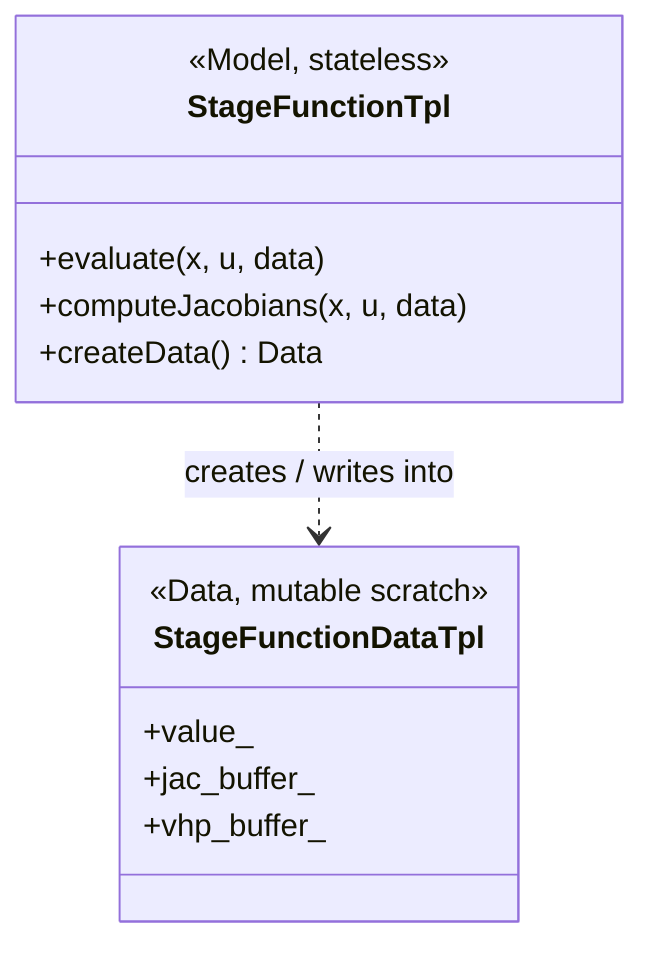
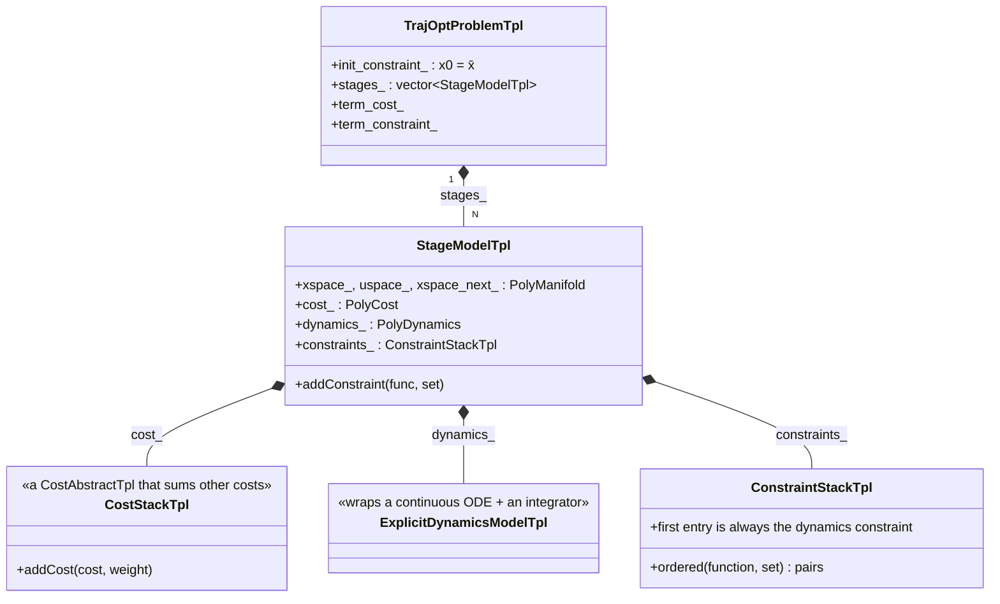
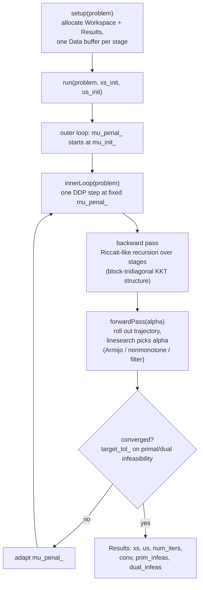
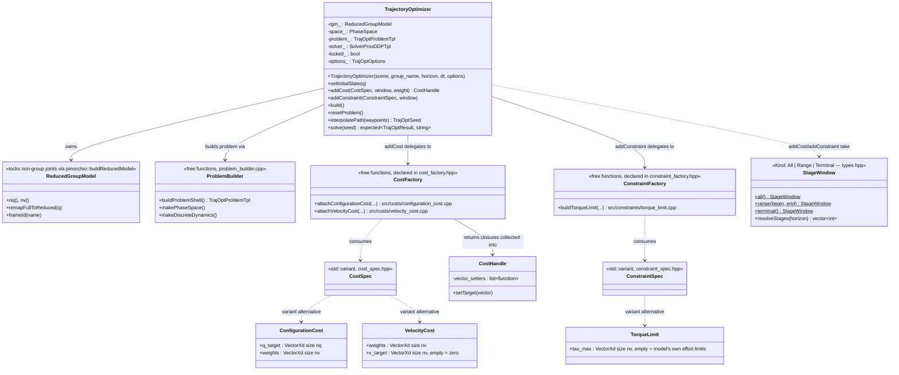
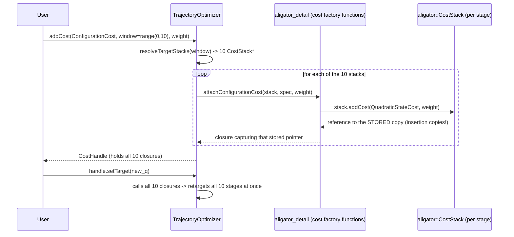

# Aligator: internal structure, and how `roboplan_aligator` uses it

This document explains two things:

1. How the upstream [Aligator](https://github.com/Simple-Robotics/aligator) library is
   structured internally — the class relationships, the design choices behind them, and how a
   problem actually gets solved.
2. How `roboplan_aligator` wraps that structure, and how `roboplan_examples/python/example_aligator_trajopt.py`
   exercises it end to end.

Source citations point at the pinned aligator commit vendored under `external/aligator`
(`c54d96450112a1bba0e3f798ac0d1f6887412df3`) and at `roboplan_aligator/`. See
`roboplan_aligator/API_NOTES.md` for the full `file:line`-verified signature list.

## 1. The problem aligator solves

Aligator solves discrete-time trajectory optimization problems of the form

```
min_{x,u}  sum_{i=0}^{N-1} l_i(x_i, u_i) + l_N(x_N)
s.t.       phi(x_i, u_i, x_{i+1}) = 0      (dynamics, i = 0..N-1)
           g(x_i, u_i) = 0                 (equality path constraints)
           h(x_i, u_i) <= 0                (inequality path constraints)
```

i.e. a multiple-shooting transcription: every knot's state `x_i` is a free variable, tied to
its neighbor by a dynamics constraint, rather than a single-shooting rollout from `x_0`. This
is the standard DDP-style formulation and is what lets the solver exploit the problem's
sequential (block-tridiagonal) structure — see §4.

## 2. Model / Data split

Every computational object in aligator — cost, dynamics, constraint residual — is split into
two classes, the same pattern Pinocchio itself uses:

- A **Model** (`CostAbstractTpl`, `StageFunctionTpl`, `ExplicitDynamicsModelTpl`) is stateless
  and `const`-callable: it knows *how* to compute a value/Jacobian/Hessian given `(x, u)`.
  Cheap to copy, safe to share.
- A **Data** (`CostDataAbstractTpl`, `StageFunctionDataTpl`) holds the mutable scratch buffers
  (`value_`, `jac_buffer_`, `vhp_buffer_`) that the Model writes into. Every Model has a virtual
  `createData()` factory (`function-abstract.hpp`).



Why: at solve time the solver calls `evaluate`/`computeJacobians` on every stage's objects many
times per outer iteration. Separating "the function" from "its scratch space" lets the solver
allocate every Data buffer exactly once in `setup()` and reuse it for the rest of the solve —
zero heap churn during optimization. This matches roboplan's own numerics rule of one
pre-allocated `pinocchio::Data` per solver instance.

## 3. Type erasure: `xyz::polymorphic<T>`

Rather than `std::shared_ptr<Base>`, aligator stores every polymorphic object (cost, dynamics,
constraint set, manifold) through `xyz::polymorphic<T>` — a value-semantic type-erasure wrapper:
it behaves like a value (copyable, no aliasing) but dispatches virtually like a pointer. E.g.
`StageModelTpl::cost_` is `polymorphic<CostAbstractTpl<Scalar>>`, not a raw/shared pointer
(`stage-model.hpp`).

**Consequence that matters downstream:** inserting a cost/dynamics object into a stack or stage
*copies* it. You never get to keep a live pointer to the object you constructed — only to
whatever the container decided to store. This is exactly the mechanism `roboplan_aligator`'s
`CostHandle` has to work around (§6).

## 4. Problem structure



Two deliberate design choices stand out:

- **Dynamics is just another constraint.** A stage's constraint stack's first entry must
  describe dynamics (`phi(x_i,u_i,x_{i+1}) = 0`) — aligator does not give dynamics a privileged,
  separately-typed slot; it unifies dynamics and path constraints under one `StageFunctionTpl`
  abstraction. `ExplicitDynamicsModelTpl` is a convenience specialization for the common explicit
  case `x' = f(x,u)`.
- **The continuous ODE and its discretization are separate, composable objects.** An
  `IntegratorSemiImplEulerTpl`/`IntegratorRK2Tpl` *wraps* a continuous `ODEAbstractTpl` (e.g.
  `MultibodyFreeFwdDynamicsTpl`, which runs Pinocchio ABA). Swapping the integrator never
  requires touching the underlying continuous dynamics model — this is exactly what
  `roboplan_aligator`'s `IntegratorType` enum leans on.
- **Costs compose recursively.** `CostStackTpl` is itself a `CostAbstractTpl` that sums other
  weighted `PolyCost`s — "a stage has one cost" and "a stage has many weighted costs" are the
  same type. `roboplan_aligator`'s `problem_builder.cpp` always wraps each stage's cost in a
  `CostStack` up front, even before any user cost is added, so `addCost` can be called any
  number of times later without restructuring anything.

## 5. Solving: proximal / augmented-Lagrangian DDP

`SolverProxDDPTpl` is a nested loop:



- **Backward/forward Riccati sweep** exploits the problem's sequential structure so each DDP
  iteration is `O(N)` rather than treating the whole trajectory as a generic dense NLP.
- **Proximal + augmented Lagrangian** (rather than an active-set QP per iteration, as in
  classical constrained DDP) folds general equality/inequality path constraints into the cost
  via a penalty adapted through `mu_penal_`. This trades per-iteration exactness for much
  simpler, reusable linear algebra — constraints are only satisfied asymptotically as `mu`
  is adapted, which is exactly why `TrajOptResult::max_constraint_violation` is reported
  honestly by `roboplan_aligator` rather than guaranteed zero.
- **Workspace vs. Results** mirrors the Model/Data split at the solver level: `Workspace` holds
  internal machinery (gains, Riccati matrices, linesearch trial buffers), `Results` holds only
  the public answer (`xs`, `us`, `num_iters`, `conv`, infeasibility numbers). `roboplan_aligator`
  reads only `solver_.results_` after `run()` — it never touches `Workspace`.

## 6. `roboplan_aligator`'s wrapper architecture



`TrajectoryOptimizer` also exposes a second, direct-aligator overload of `addCost`/`addConstraint`
(taking `xyz::polymorphic<CostAbstractTpl<double>>` / `(StageFunctionTpl, ConstraintSetTpl)`
directly, bypassing `CostSpec`/`ConstraintSpec`/the factories entirely) — the "Tier 2" / advanced
C++-only path documented in `roboplan_aligator/CLAUDE.md`, not shown above since it has no
factory/spec machinery to diagram; it is the mechanism item 3 of `docs/aligator_handover.md` still
needs an end-to-end test for.

**Supporting value types** (all in `types.hpp`, plain structs/enum, no behavior beyond what's
listed):

| Type | Fields / values | Notes |
| --- | --- | --- |
| `IntegratorType` (enum) | `SemiImplicitEuler` (default), `RK2` | Selects which aligator integrator `problem_builder.cpp` instantiates (§4). |
| `TrajOptOptions` | `max_iters=100`, `tol=1e-4`, `mu_init=1e-2`, `integrator`, `verbose=false`, `control_reg=1e-3`, `record_history=false`, `linear_solver_choice=SERIAL`, `num_threads=1`, `rollout_type=LINEAR` | Passed to the constructor. `record_history`/`linear_solver_choice`/`num_threads`/`rollout_type` are the §8 diagnostics/tunables. |
| `TrajOptSeed` | `xs: vector<VectorXd>` (N+1 states `[q;v]`), `us: vector<VectorXd>` (N controls) | Warm start; from `interpolatePath()` or hand-built. |
| `TrajOptResult` | `converged`, `iterations`, `cost`, `max_constraint_violation`, `xs`, `us`, `controls`, `trajectory: TrajOptTrajectory`, `history: vector<TrajOptIterate>`, `toRoboplan(scene, group_name) -> JointTrajectory` | Returned by `solve()` wrapped in `tl::expected<TrajOptResult, std::string>`. |
| `TrajOptTrajectory` | `times`, `positions`, `velocities` (each size N+1) | `TrajOptResult::trajectory`; sampled at `dt`, reduced-group layout. |
| `TrajOptIterate` | `iteration`, `cost`, `prim_infeas`, `dual_infeas` | One entry per ProxDDP iteration; see §8. |

**Lifecycle: `build()` / `resetProblem()`.** `TrajectoryOptimizer` has one boolean gate,
`locked_`, set by `build()` and cleared by `resetProblem()`. Before `build()`: `addCost`/
`addConstraint` are legal (they mutate the in-progress `problem_`); `solve()` returns a
`tl::unexpected` (not a throw — a missing `build()` is a recoverable per-call misuse, matching the
numerics rule of `tl::expected` for recoverable failures) since there is no allocated solver
workspace yet. After `build()`: `solve()` is legal and repeatable; `addCost`/`addConstraint` throw
`std::logic_error` (the cost/constraint *structure* — which residuals exist — is frozen; a
`CostHandle::setTarget` call is still legal between solves, since it only rewrites a value inside
an already-inserted residual, not the structure). `resetProblem()` discards `problem_`/`solver_`
state and clears `locked_`, requiring `addCost`/`addConstraint`/`build()` again before the next
`solve()`. `build()` is also where `linear_solver_choice`/`num_threads`/`rollout_type` are
consumed once (§8) and where a `Parallel`+`NonLinear` combination throws (an aligator
`RuntimeError`, itself a `std::runtime_error`).

**File layout** mirrors `roboplan_oink`'s one-type-per-file convention: each spec struct
(`ConfigurationCost`, `VelocityCost`, `TorqueLimit`) lives in its own header under
`include/roboplan_aligator/costs/` or `constraints/`, with a matching `.cpp` under `src/costs/`
or `src/constraints/`. `CostHandle` — shared infrastructure used by every cost, not a cost type
itself — lives in its own top-level `cost_handle.hpp`, outside `costs/`. `cost_factory.hpp` /
`constraint_factory.hpp` remain single declaration-surface headers (all cost-factory functions /
all constraint-factory functions respectively) rather than being split further, since they
declare a domain's functions rather than one type's — there is no direct oink analogue for that
indirection layer (see §6's "why" discussion below, and `roboplan_aligator/CLAUDE.md`).
`attachConfigurationCost` and `attachVelocityCost` share their insert/cast/closure-building logic
via an internal helper, `aligator_detail::attachMaskedStateCost`
(`costs/masked_state_cost.{hpp,cpp}`), that both call after building their own target vector and
weight mask — the two functions no longer duplicate that plumbing.

**Why the cost/constraint path looks the way it does** (see the earlier discussion for full
detail): a `CostSpec` (e.g. `ConfigurationCost{q_target, weights}`) is a plain description.
`addCost(spec, window, weight)`:

1. Resolves `window` to the list of already-in-problem `CostStack` pointers it targets (one per
   stage, since aligator gives every stage its own independent stack — no cross-stage sharing).
2. For each target stack, a factory function (`attachConfigurationCost`) builds the actual
   aligator `QuadraticStateCostTpl` (masked to the config-tangent block only — aligator has one
   generic full-state quadratic cost, not a dedicated "cost on q only"), inserts it, and —
   because insertion copies (§3) — recovers a pointer to the *stored* copy to build a `setTarget`
   closure against.
3. All those per-stage closures are collected into one `CostHandle`, so a single
   `handle.setTarget(new_q)` call retargets every stage the window covered.



## 7. Walking through `example_aligator_trajopt.py`

The example (`roboplan_examples/python/example_aligator_trajopt.py`) compares three ways to turn
an RRT path into an executable trajectory: raw RRT, RRT+TOPP-RA, and RRT+`roboplan_aligator`. The
aligator-specific part (lines 225–272):

```mermaid
flowchart LR
    A["RRT.plan(start, goal)\n-> geometric JointPath"] --> B["opt = TrajectoryOptimizer(\n  scene, group_name, horizon, dt,\n  TrajOptOptions(max_iters))"]
    B --> C["opt.setInitialState(q_start)"]
    C --> D["opt.addCost(ConfigurationCost\n  q_target=goal, weights=500)\n  @ terminal timestep"]
    D --> E["opt.addCost(VelocityCost weights=20\n  @ terminal) -- settle at rest"]
    E --> F["opt.addCost(VelocityCost weights=1\n  @ all stages) -- damping"]
    F --> G["opt.addConstraint(TorqueLimit()) --\n  defaults to URDF effort limits"]
    G --> H["opt.build()\n(freezes cost/constraint structure,\nallocates solver workspace)"]
    H --> I["seed = opt.interpolatePath(rrt_path.positions)\n(joint-space straight-line seed)"]
    I --> J["result = opt.solve(seed)"]
    J --> K["result.toRoboplan(scene, group_name)\n-> full-model JointTrajectory"]
```



Concretely, this is the exact sequence from the source:

```python
opt = al.TrajectoryOptimizer(scene, group_name, horizon, aligator_dt,
                              al.TrajOptOptions(max_iters=max_iters))
opt.setInitialState(np.asarray(start.positions))

target = al.ConfigurationCost()
target.q_target = np.asarray(goal.positions)
target.weights = np.full(opt.nv(), 500.0)
opt.addCost(target, timesteps=opt.horizon())        # reach the goal at the terminal stage

settle = al.VelocityCost()
settle.weights = np.full(opt.nv(), 20.0)
opt.addCost(settle, timesteps=opt.horizon())         # arrive at rest

damping = al.VelocityCost()
damping.weights = np.full(opt.nv(), 1.0)
opt.addCost(damping)                                 # damp velocity along the whole horizon

torque_limit = al.TorqueLimit()                       # defaults to URDF effort limits
opt.addConstraint(torque_limit)

opt.build()
result = opt.solve(opt.interpolatePath(list(path.positions)))
aligator_traj = result.toRoboplan(scene, group_name)
```

A few things worth calling out about why it's written this way:

- **Terminal-only reach cost + horizon-wide damping cost** is a common OCP idiom: a hard "be at
  the goal" objective only at the last knot, plus a soft regularizer everywhere, rather than
  pulling every stage toward the goal (which would fight the dynamics). The example's own
  comment notes that without the terminal velocity cost, "a pure terminal reach settles on a
  dynamically-inconsistent swing-through" — i.e. position-only terminal cost alone lets the
  solver arrive at the right place while still moving, which isn't a usable stopping state.
- **`TorqueLimit()` left empty** deliberately defaults to the reduced model's own URDF effort
  limits rather than a user-supplied flat bound — a value tuned for a small arm can make the
  problem infeasible on a heavier one, so "inherit the robot's actual limits" is the safer
  default.
- **`interpolatePath` (not a dynamics rollout)** is the warm start: a straight-line joint-space
  interpolation of the RRT waypoints, zero velocity/control. Upstream aligator's own examples
  typically warm-start with a quasistatic-torque dynamics rollout instead; `roboplan_aligator`
  trades a few extra solver iterations for not needing per-cost quasistatic-torque computation
  in the general wrapper.
- **No collision constraint** — the example's comment is explicit that hard collision avoidance
  isn't part of this release's API (see the "future work" discussion): RRT and TOPP-RA both
  honestly avoid the obstacle (by construction / by not touching path geometry), but aligator's
  reshaped trajectory is not guaranteed to.
- **`result.toRoboplan(scene, group_name)`** converts back from the optimizer's reduced-group
  layout to a full-model `JointTrajectory` (non-group DoF zeroed, accelerations empty, torques
  dropped — use `result.us`/`result.controls` for those) so the rest of roboplan's visualization
  and execution pipeline can treat it like any other `JointTrajectory`.

## 8. Diagnostics and performance tunables

Two features were added on top of the architecture above; both are documented in
`API_NOTES.md` under "Prompt 13"/"Prompt 14" with full `file:line` citations.

**Solver diagnostics (Prompt 13), two tiers:**

- **Tier 1 (Python + C++):** `TrajOptOptions::record_history` (off by default) wraps aligator's
  own `HistoryCallbackTpl` rather than a bespoke callback — it already collects exactly what's
  needed (`values`/`prim_infeas`/`dual_infeas`, pushed in lockstep once per accepted ProxDDP
  iteration). When enabled, `TrajectoryOptimizer` registers it on `solver_` at construction time
  and clears its vectors at the start of every `solve()`, so `TrajOptResult::history` reflects
  only the most recent solve, never an accumulation across repeated solves on one built problem.
- **Tier 2 (C++ only):** `TrajectoryOptimizer::registerCallback(name, callback)` is a narrow
  passthrough to `solver_.registerCallback` — deliberately not a `solver()` getter, so lifecycle
  invariants (the `locked_` gate, `solve()`'s own seed validation) can't be bypassed. Not bound to
  Python, matching the existing direct-aligator cost/constraint precedent.
- **A real move-safety subtlety**: `HistoryCallbackTpl` stores a raw pointer to the solver it was
  built against. `TrajectoryOptimizer`'s move constructor relocates `solver_` to a new address, so
  the history callback is never moved — it's reconstructed fresh, bound to the new `solver_`,
  after every move/construction.

**Solver performance tunables (Prompt 14):** `TrajOptOptions::linear_solver_choice`
(`aligator::LQSolverChoice` — Serial/Parallel/StagedDense), `num_threads`, and `rollout_type`
(`aligator::RolloutType` — Linear/NonLinear), exposed as direct aligator enum types (no roboplan
mirror enum needed, unlike `IntegratorType` — these already exist as aligator's own public solver
fields, whereas `IntegratorType` parameterizes *which aligator class* `problem_builder.cpp`
instantiates, with no single upstream enum to reuse).

The important design point: these three are applied **once, inside `build()`, before
`solver_.setup()`** — unlike `tol`/`mu_init`/`max_iters`/`verbose`, which `solve()` re-copies onto
the solver every call. This is not a style choice; it's forced by aligator's own internals:
`linear_solver_choice`/`num_threads` are read directly inside `setup()` to construct the solver's
internal linear-solver object, and `rollout_type`'s Parallel+NonLinear incompatibility check also
only runs once, at `setup()` time. Reapplying `rollout_type` later in `solve()` (mirroring the
other four options) would let a user silently switch to an unchecked, unsupported combination
after `build()`. `build()` does not pre-validate the combination itself — it lets aligator's own
`setup()` throw (`aligator::RuntimeError`, a `std::runtime_error`), consistent with the existing,
already-uncaught `checkIntegrity()` throw path.

## References

- `roboplan_aligator/API_NOTES.md` — verified, `file:line`-cited aligator/pinocchio signatures.
- `roboplan_aligator/CLAUDE.md` — package conventions and the two cost/constraint API paths.
- `docs/design/roboplan_trajopt_design_v4.md` — authoritative design spec (note: some sections
  describe cost/constraint types since removed from the shipped package; see git history on
  `roboplan_aligator/`).
- `external/aligator/include/aligator/core/{stage-model,traj-opt-problem,function-abstract,cost-abstract}.hpp`,
  `external/aligator/include/aligator/solvers/proxddp/solver-proxddp.hpp` — upstream source for
  §1–5 above.
- `external/aligator/include/aligator/core/{callback-base,history-callback,enums}.hpp` — upstream
  source for §8 (diagnostics callback, `RolloutType`).
- `docs/aligator_handover.md` — status/handover notes: what's implemented, what's next, and
  context a fresh session needs to continue (not architecture — see this file for that).
